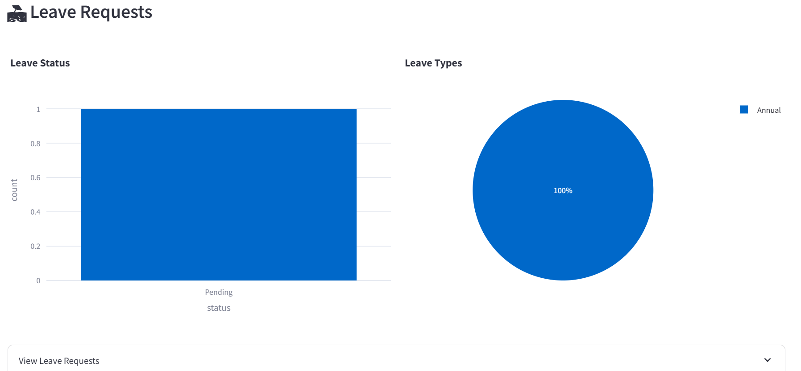

# 🏢 HRMS Agent

> AI-powered Human Resource Management System with a Claude agentic loop, deployed on AWS ECS Fargate with Terraform IaC and GitHub Actions CI/CD.

**🔗 Live Demo:** [https://hrms.basilatiyire.com](https://hrms.basilatiyire.com)  
**📦 Repository:** [github.com/BaselAtiyire/hrms-agent](https://github.com/BaselAtiyire/hrms-agent)

---

## 📸 Screenshots

### 🏢 HR Analytics Dashboard

*Real-time KPIs — 14 employees, 4 open tickets, 48 onboarding tasks, 1 pending leave request. Department breakdown and access role distribution charts.*

### 🎫 Tickets Overview

*Ticket analytics — 4 open and 1 in-progress tickets. 80% are IT category. Bar and pie charts update in real time from the live database.*

### 📋 Onboarding Tasks

*48 pending onboarding tasks evenly split across IT, HR and Manager owners. Tasks are auto-generated on employee hire via the agent workflow.*

### 🏖️ Leave Request Analytics

*1 pending annual leave request. Status and leave type breakdown charts update live. Drill into the table to approve or reject directly.*

### 🏖️ Leave Request Approval

*Role-based approval flow. Alice Johnson (E001) acting as approver can approve or reject L0001 (Brian Smith, Annual Leave, family trip) with a single click. Full audit trail written on every action.*

### 👥 Employee Directory

*Live employee table with department, role, manager, status and system role. Supports status updates with full audit logging.*

### 🤖 Claude AI Agent — Proactive Alerts

*The agent proactively surfaces 5 alerts on load — 4 stale tickets open over 7 days and 1 leave request pending over 3 days — without being asked.*

### 📋 Audit Log Sidebar

*Structured JSON audit trail. Every approve, reject, close, and update action is logged to `/data/audit.log` on EFS with timestamp, actor, and details.*

---

## 🏗️ Architecture

```
Internet
    │
    ▼ HTTPS (443)
Application Load Balancer  ← basilatiyire.com (ACM SSL cert)
    │
    ▼ HTTP (8501)
ECS Fargate Task           ← Streamlit + Claude Agent
    │                         Single replica (SQLite-safe)
    ├──► EFS /data/hrms.db    SQLite — encrypted, persistent
    ├──► EFS /data/audit.log  Audit trail
    ├──► ECR Image            Docker image (multi-stage build)
    ├──► Secrets Manager      OPENAI_API_KEY
    └──► CloudWatch Logs      /ecs/hrms-prod (30-day retention)
```

---

## ✨ Features

### 🤖 Production-Grade AI Agent
- **Multi-step planning** — "Hire Sarah Connor as DevOps in IT" triggers: create employee → onboarding tasks → IT ticket in one prompt
- **Persistent memory** — conversation history and facts survive Streamlit restarts via `agent_memory.json` on EFS
- **Proactive alerts** — agent surfaces overdue onboarding tasks, stale tickets (>7 days), and long-pending leave requests on every load
- **Self-correction** — failed tool calls retry up to 3 times with graceful fallback messaging
- **Tool use** — Claude calls 12 tools against live SQLite data (read + write)

### 📊 Analytics Dashboard
- Real-time KPIs: employee count, open tickets, pending onboarding, pending leave
- Employees by department (bar chart) and access role (pie chart)
- Department filter across all tabs

### ✅ Leave Management
- Role-based approval — only `Manager`, `HR Admin`, `HR Staff` can approve/reject
- One-click approve ✅ / reject ❌ per request
- Overlap validation and state guards (can't approve already-approved requests)

### 📋 Audit Trail
- Every action writes a structured JSON line to `audit.log`
- Live sidebar panel with action filter and export button
- Covers: `LEAVE_APPROVED`, `LEAVE_REJECTED`, `TICKET_CLOSED`, `ONBOARDING_TASK_COMPLETED`, `EMPLOYEE_UPDATED`

### 🎫 Ticket & Onboarding Management
- Close open tickets directly from the dashboard
- Mark onboarding tasks complete with actor tracking
- Update employee status with audit log entry

---

## 🛠️ Tech Stack

| Layer | Technology |
|---|---|
| **AI Agent** | Anthropic Claude Sonnet (tool use API) |
| **Frontend** | Streamlit |
| **Backend** | FastAPI + SQLAlchemy |
| **Database** | SQLite on AWS EFS |
| **MCP Server** | FastMCP (HR tools exposed via Model Context Protocol) |
| **Container** | Docker (multi-stage, non-root user) |
| **Registry** | AWS ECR |
| **Compute** | AWS ECS Fargate |
| **Networking** | AWS ALB + VPC |
| **Storage** | AWS EFS (encrypted) |
| **Secrets** | AWS Secrets Manager |
| **SSL** | AWS Certificate Manager |
| **DNS** | Namecheap → basilatiyire.com |
| **IaC** | Terraform (38 AWS resources) |
| **CI/CD** | GitHub Actions |
| **Logging** | AWS CloudWatch + structured JSON audit log |

---

## 🚀 CI/CD Pipeline

```
git push origin main
        │
        ▼
GitHub Actions
        ├── docker build
        ├── docker push → ECR
        └── aws ecs update-service → ECS Fargate
        │
        ▼
Live at https://hrms.basilatiyire.com
```

Every push to `main` automatically builds, pushes, and deploys. No manual steps.

---

## 📁 Project Structure

```
hrms-agent/
├── agent/
│   ├── hr_agent_v2.py        # Production agent (5 capabilities)
│   ├── chat_ai.py            # OpenAI NLP parser
│   └── hr_agent.py           # Base agent tools
├── app/
│   ├── main.py               # FastAPI app + /health endpoint
│   ├── models.py             # SQLAlchemy models
│   ├── schemas.py            # Pydantic schemas
│   ├── services/             # Employee, ticket, leave, onboarding services
│   └── routes/               # API routes
├── pages/
│   └── 1_HR_Dashboard.py     # Multi-page Streamlit dashboard
├── infra/
│   └── main.tf               # Terraform — full AWS stack
├── .github/workflows/
│   └── deploy.yml            # GitHub Actions CI/CD
├── streamlit_app_standalone.py  # Main dashboard (no app/ deps)
├── hr_mcp_server.py          # MCP server
├── Dockerfile                # Multi-stage build
├── docker-compose.yml        # Local development
└── requirements.txt
```

---

## 🏃 Local Development

**Prerequisites:** Python 3.12, Docker

```bash
git clone https://github.com/BaselAtiyire/hrms-agent.git
cd hrms-agent

# Create virtual environment
python -m venv .venv
.venv\Scripts\activate  # Windows
# source .venv/bin/activate  # Mac/Linux

# Install dependencies
pip install -r requirements.txt

# Set environment variables
cp .env.example .env
# Add your ANTHROPIC_API_KEY to .env

# Run locally
streamlit run streamlit_app_standalone.py
```

Or with Docker:
```bash
docker compose up --build
# App at http://localhost:8501
```

---

## ☁️ AWS Deployment

Infrastructure is fully managed with Terraform.

```bash
# Bootstrap remote state (one-time)
aws s3 mb s3://hrms-tfstate-prod --region us-east-1
aws dynamodb create-table --table-name hrms-tfstate-lock ...

# Provision infrastructure
cd infra/
cp prod.tfvars.example prod.tfvars
terraform init
terraform apply -var-file="prod.tfvars"

# Build and push Docker image
docker build -t hrms-prod .
docker push <ecr-url>/hrms-prod:latest

# Force ECS deployment
aws ecs update-service --cluster hrms-prod-cluster \
  --service hrms-prod-service --force-new-deployment
```

See [DEPLOYMENT.md](DEPLOYMENT.md) for the full step-by-step guide.

---

## 💰 Infrastructure Cost

Optimised from **~$62/month → ~$27/month (56% reduction)** by removing the NAT Gateway and moving ECS tasks to public subnets — eliminating the single largest cost driver without compromising application security. The ALB and ACM SSL cert handle all public-facing security at the edge.

| Service | Monthly |
|---|---|
| Application Load Balancer | ~$17 |
| ECS Fargate (0.5 vCPU / 1GB) | ~$9 |
| EFS (SQLite + audit log) | ~$0.30 |
| ECR + Secrets Manager + CloudWatch | ~$1 |
| **Total** | **~$27/month** |

> **Architecture decision:** SQLite on EFS with a single Fargate replica is intentional — it eliminates RDS costs (~$30+/month) while remaining safe for internal HR tooling traffic. The trade-off (no horizontal scaling) is acceptable for this use case.

---

## 🔒 Security

- Container runs as non-root user (UID 1001)
- EFS volume encrypted at rest
- API keys stored in AWS Secrets Manager — never in code or image
- HTTPS enforced via ACM SSL cert — HTTP redirects to HTTPS
- ECR image scanning on every push
- Role-based access control on leave approvals

---

## 📄 License

MIT — see [LICENSE.txt](LICENSE.txt)

---

## 👤 Author

**Basel Atiyire**  
🌐 [basilatiyire.com](https://basilatiyire.com)  
💼 [LinkedIn](https://linkedin.com/in/basilatiyire)  
📦 [GitHub](https://github.com/BaselAtiyire)
