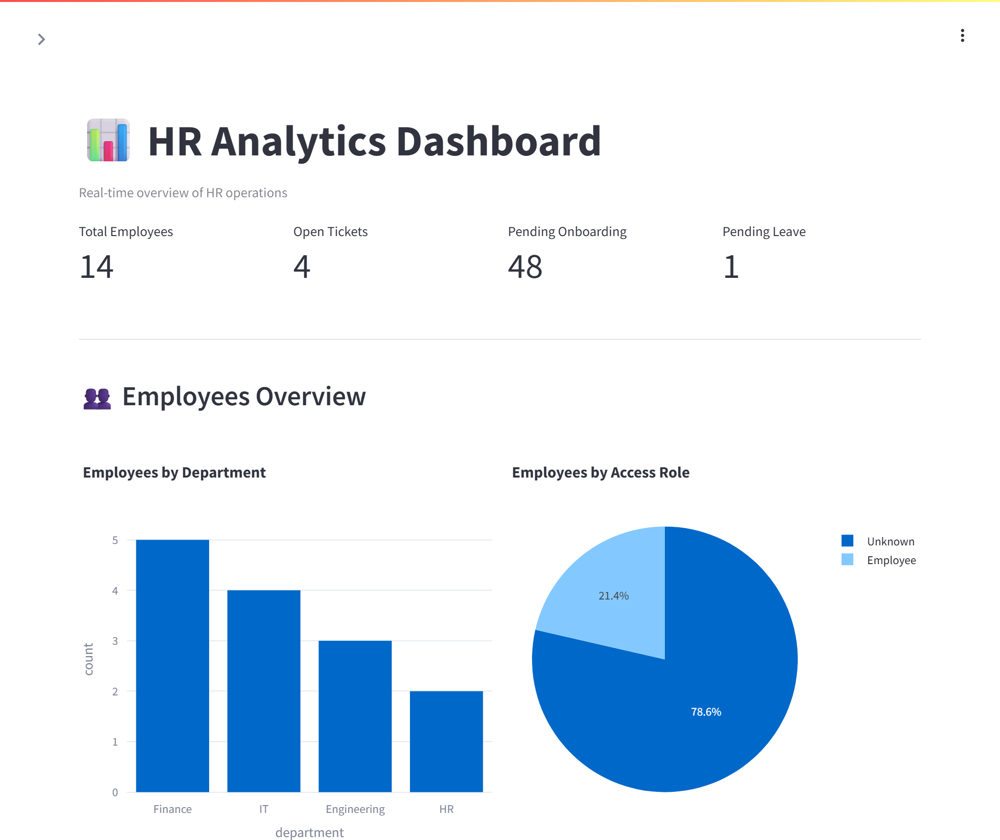
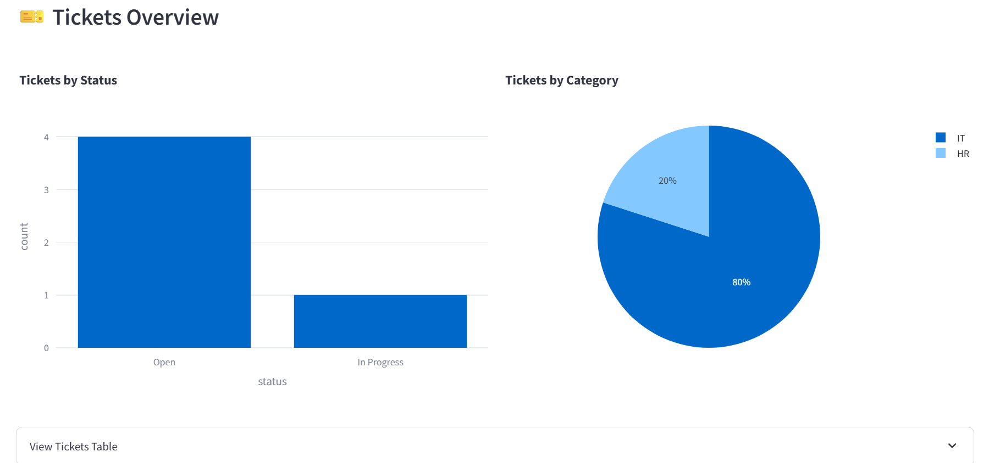
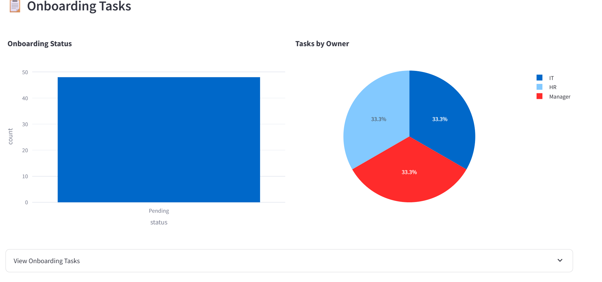
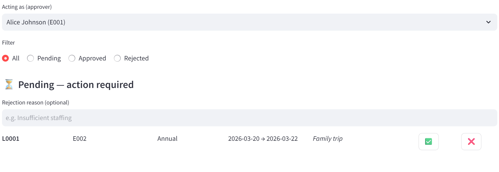
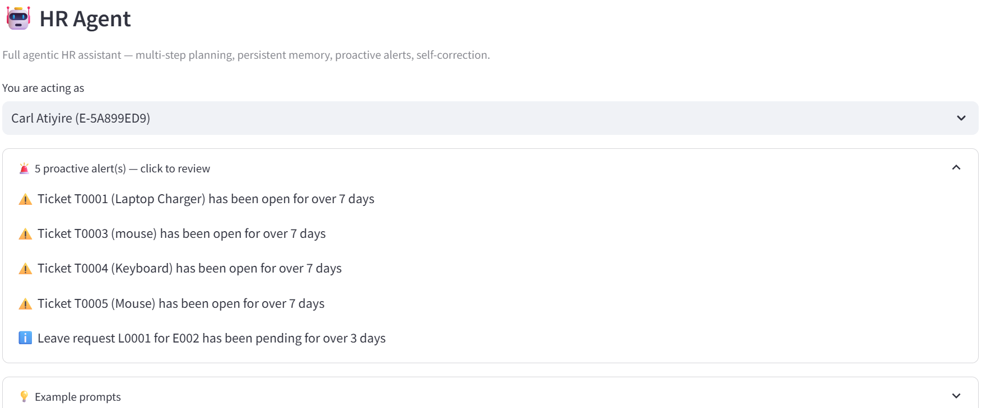
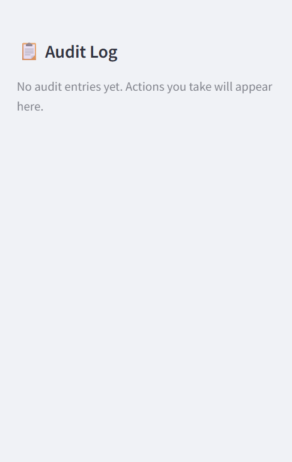

# HRMS Agent — Autonomous AI HR System

> An autonomous AI system that executes multi-step HR workflows — hire, onboard, IT provisioning — from a single natural language prompt. Live in production on AWS ECS Fargate.

**Basel Atiyire** · basilatiyire@gmail.com · [hrms.basilatiyire.com](https://hrms.basilatiyire.com)

    

---

## 🎬 Video Walkthrough

**[Watch on Loom →](https://www.loom.com/share/37ae9b646ffe4f02b8ace85ed858e413)**

The walkthrough covers: why I chose this problem, a live demo of the agent executing a full hire-to-onboard workflow, architecture walkthrough, and what I'd build next.

---

## 📸 Screenshots

### 🏢 HR Analytics Dashboard

*Real-time KPIs — 14 employees, 4 open tickets, 48 onboarding tasks, 1 pending leave request.*

### 🎫 Tickets Overview

*4 open and 1 in-progress tickets. 80% are IT category. Charts update in real time from the live database.*

### 📋 Onboarding Tasks

*48 pending onboarding tasks auto-generated on employee hire via the agent workflow.*

### 🏖️ Leave Request Approval

*Role-based approval flow. One-click approve/reject with full audit trail written on every action.*

### 🤖 Claude AI Agent — Proactive Alerts

*The agent proactively surfaces 4 stale tickets and 1 pending leave request on load — without being asked.*

### 📋 Audit Log Sidebar

*Structured JSON audit trail. Every action logged to `/data/audit.log` on EFS with timestamp, actor, and details.*

---

## 01 · Problem Statement

When a company hires someone, a single event fans out into tasks across HR, IT, and management — create the employee record, generate onboarding tasks, open IT provisioning tickets, notify the manager, track completion. In most companies without enterprise integrations, this coordination happens manually: an HR manager opens the HRIS, then a ticketing system, then a spreadsheet, then follows up two days later to see what stalled.

The people most affected are **HR and operations staff at small-to-mid-sized companies** who carry coordination overhead that doesn't require their judgment — just their time.

| Metric | Value |
|---|---|
| Tools the agent can call | 12 |
| Infrastructure cost reduction | 56% ($62 → $27/month) |
| Prompts to hire → onboard → IT ticket | 1 |

AI is the right tool here because this isn't a form-fill or a rigid script problem. Onboarding is **conditional and stateful**: if IT provisioning fails, dependent tasks need to hold; if instructions are ambiguous, the system should ask rather than guess. That requires reasoning, not just routing.

---

## 02 · Solution Overview

HRMS Agent is a production-deployed autonomous AI system built on Streamlit + FastAPI, backed by Claude's tool-use API, and running live on AWS ECS Fargate. It accepts natural language instructions and executes complex, multi-step HR workflows — reasoning over tool outputs at each step, recovering from failures, and surfacing proactive alerts without being asked.

### Core agent capabilities

- **Multi-step planning** — `"Hire Sarah Connor as DevOps in IT"` triggers: create employee → generate onboarding tasks → open IT ticket, all from one prompt
- **Persistent memory** — `agent_memory.json` on AWS EFS, surviving Streamlit restarts and container replacements
- **Proactive alerting** — surfaces stale tickets (>7 days) and pending leave requests (>3 days) on every load without being prompted
- **Self-correcting execution** — failed tool calls retry up to 3 times with graceful fallback messaging
- **Role-based access control** — leave approvals restricted to Manager, HR Admin, HR Staff; every action logged to structured JSON audit trail

### Dashboard features

- Real-time KPIs: employee count, open tickets, pending onboarding, pending leave
- Leave approval flow with overlap validation and state guards
- Ticket and onboarding task management with actor tracking
- Structured JSON audit sidebar — filterable, exportable

---

## 03 · AI Integration

### Why Claude's tool-use API

I chose **Claude Sonnet** for its tool-use reliability and structured output consistency. When an agent is executing real write operations against a live database — creating employees, opening tickets, updating statuses — a hallucinated tool call or malformed parameter isn't just unhelpful, it corrupts data. Claude's tool-use API gave me the most consistent, schema-adherent invocation behavior across all my testing.

The agent registers **12 tools** exposed via a **FastMCP server** (`hr_mcp_server.py`) — the Model Context Protocol gives me a structured, auditable interface between the agent and the underlying HR data layer. Every tool call, input, and output is captured in LangSmith for full observability.

### Agentic patterns used

- **Tool-use with chaining** — tools called sequentially; each output informs the next call. The hire workflow chains 3 tools in a single execution.
- **Self-correcting execution** — 3-retry logic with graceful fallback before surfacing errors to the user
- **Persistent cross-session memory** — `agent_memory.json` on EFS without a separate vector store
- **Proactive alerting without prompting** — agent scans on load and surfaces time-sensitive items before the user asks
- **MCP-based tool registry** — tools defined once in FastMCP server, consumed cleanly by the agent

### Tradeoffs considered

| Dimension | Decision | Tradeoff |
|---|---|---|
| Cost vs. capability | Claude Sonnet over Opus | Sonnet hits the reliability bar at lower cost. Opus added latency with no quality gain. |
| Database vs. scalability | SQLite on EFS, single Fargate replica | Eliminated RDS (~$30+/month). Trade-off: no horizontal scaling. |
| Infrastructure cost vs. security | Public subnets, removed NAT Gateway | Cut cost 56% ($62 → $27). Tight security groups + ALB + ACM SSL. No security regression. |
| Observability vs. complexity | LangSmith + CloudWatch | LangSmith for per-tool-call traces; CloudWatch for container logs. |
| Flexibility vs. auditability | Structured JSON audit log | Every write logged with timestamp, actor, details. Fully defensible. |

### Where AI exceeded expectations

The proactive alerting behavior. I defined the tool and gave the agent context about what "stale" meant — but the decision to surface alerts unprompted emerged from the model's instruction-following. I didn't hardcode that; the agent reasoned its way to it.

### Where it fell short

Latency under concurrent load. The single-replica synchronous design was intentional (SQLite safety) but limits throughput. First thing I'd address in v2.

---

## 04 · Architecture & Design Decisions
Internet
│
▼ HTTPS (443)
Application Load Balancer  ← basilatiyire.com (ACM SSL cert)
│
▼ HTTP (8501)
ECS Fargate Task           ← Streamlit + Claude Agent
│                         Single replica (SQLite-safe)
├──► EFS /data/hrms.db       SQLite — encrypted, persistent
├──► EFS /data/audit.log     Structured JSON audit trail
├──► EFS agent_memory.json   Cross-session agent memory
├──► ECR Image               Docker image (multi-stage build)
├──► Secrets Manager         ANTHROPIC_API_KEY
└──► CloudWatch Logs         /ecs/hrms-prod (30-day retention)
FastMCP Server (hr_mcp_server.py)
└── 12 HR tools exposed via Model Context Protocol
Agent calls tools → SQLite reads/writes → audit log
GitHub Actions CI/CD
git push → docker build → ECR push → ECS update
Every push to main deploys automatically. No manual steps.
