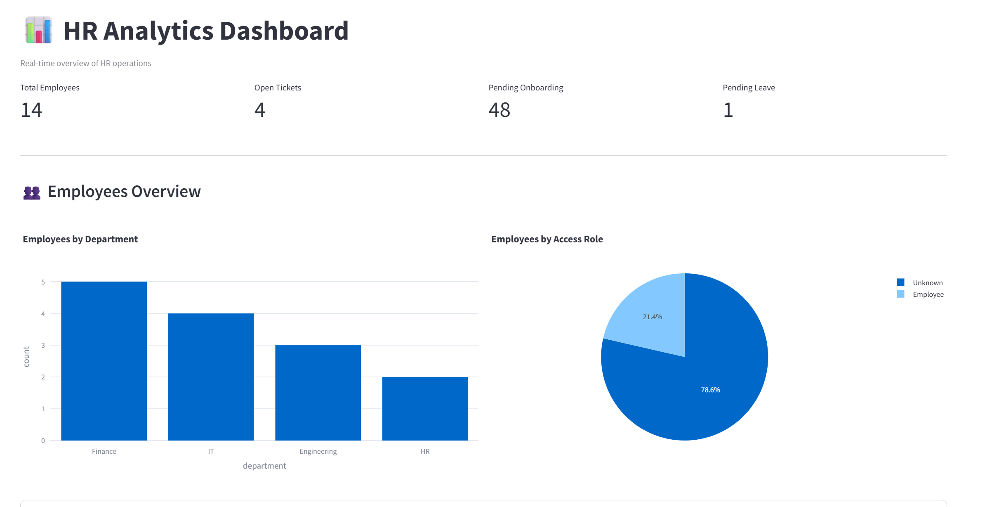
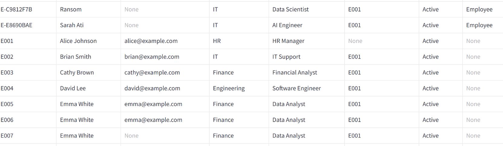

# HRMS Analytics & HR Agent

Internal **Human Resources Management System** with a Streamlit analytics dashboard, audit logging, and an AI assistant for HR workflows (onboarding, leave, tickets, and policy Q&A).

---

## Highlights

- **Dashboard** — KPIs and charts for headcount, tickets, leave, and onboarding.
- **Employees** — Browse and manage employee records.
- **Leave requests** — Track and act on pending approvals.
- **HR agent** — Conversational assistant with persistent memory for policies and multi-step tasks.
- **Audit trail** — Structured actions recorded for compliance review.

Deployment and AWS architecture are documented in [`DEPLOYMENT.md`](DEPLOYMENT.md).

---

## Screenshots

### Dashboard — KPIs & charts



### Employees



### Leave requests


### HR agent


### Audit sidebar


---

## Tech stack

| Layer | Choice |
|--------|--------|
| UI | Streamlit |
| API / agent | Python, FastAPI (where applicable) |
| Data | SQLite (`hrms.db`), SQLAlchemy |
| Cloud (optional) | ECS Fargate, ALB, EFS, ECR — see `DEPLOYMENT.md` |

---

## Local development

```bash
python -m venv .venv
.venv\Scripts\activate
pip install -r requirements.txt
# Run the Streamlit app per your project entrypoint (e.g. streamlit run ...)
```

---

## License

Proprietary / internal use unless otherwise stated.
